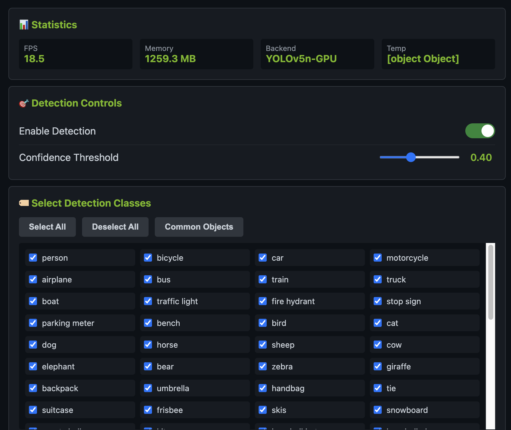

# Jetson Camera Streaming

Real-time camera streaming with AI object detection for NVIDIA Jetson Nano.



## Features

- 🎥 Hardware-accelerated video capture (GStreamer + NVMM)
- 🧠 Real-time object detection (YOLOv5n, 80 COCO classes)
- 🌐 WebSocket streaming (<100ms latency)
- 🎯 Configurable detection (select objects, adjust confidence)
- 📊 GPU monitoring (TensorRT, CUDA status)
- 🐳 Docker containerized

## Quick Start

**Prerequisites:** Jetson Nano with JetPack 4.x, Raspberry Pi Camera Module v2, Docker

```bash
# Deploy to Jetson
./scripts/deploy.sh nvidia <JETSON-IP> jetson-webcam

# Build and run on Jetson
ssh nvidia@<JETSON-IP>
cd jetson-webcam
sudo docker-compose up -d --build
```

**Access:** http://\&lt\;JETSON-IP\&gt\;:8000

## API Endpoints

### Web Interface
- `GET /` - Main streaming interface
- `GET /gpu` - GPU status dashboard

### Streaming & Stats
- `WebSocket /ws/video` - Video stream
- `GET /health` - Health check
- `GET /api/stats` - FPS, memory, temperature

### Detection Control
- `POST /api/detection` - Enable/disable detection
- `POST /api/detection/classes` - Select objects to detect
- `POST /api/detection/params` - Adjust confidence threshold
- `POST /api/quality` - Set JPEG quality (0-100)

### GPU Monitoring  
- `GET /api/gpu-status` - TensorRT/CUDA status
- `GET /api/run-gpu-tests` - Run validation tests

## Object Detection

YOLOv5n detects 80 COCO objects including:
- **People & Animals:** person, bird, cat, dog, horse, cow, elephant, bear, zebra, giraffe
- **Vehicles:** bicycle, car, motorcycle, airplane, bus, train, truck, boat
- **Indoor:** chair, couch, bed, table, toilet, tv, laptop, keyboard, phone, book
- **Kitchen:** bottle, cup, fork, knife, spoon, bowl, banana, apple, pizza
- **Sports:** frisbee, skis, surfboard, tennis racket, baseball bat

Configure via web UI: toggle detection, select classes, adjust confidence (default: 0.4)

## Configuration

**Camera** ([app/camera.py](app/camera.py)):
```python
DEFAULT_WIDTH = 1280
DEFAULT_HEIGHT = 720  
DEFAULT_FPS = 30
```

**JPEG Quality** ([app/encoder.py](app/encoder.py)):
```python
DEFAULT_QUALITY = 95  # 0-100
```

## Development

**Project Structure:**
```
app/          # FastAPI application, streaming, detection
scripts/      # Deploy, build, test scripts
docs/         # Additional documentation
```

**Run Tests:**
```bash
./scripts/run_tests.sh  # On Jetson
```

**Tech Stack:**
- Base: NVIDIA L4T PyTorch (r32.7.1-pth1.10-py3)
- CUDA 10.2, TensorRT 8.2.1.8
- Python 3.6, FastAPI, OpenCV, PyTorch

## Troubleshooting

**Camera issues:**
```bash
ls -l /dev/video*
dmesg | grep -i ov5647
```

**GPU issues:**
```bash
docker-compose exec jetson-vision python3 /app/gpu_health_check.py
```

**Performance:**
- Check `/api/stats` for FPS and client count
- Reduce JPEG quality or disable detection
- Monitor with `tegrastats`

## Documentation

- [Quick Reference](docs/QUICKSTART.md)
- [YOLO Implementation](docs/YOLO_IMPLEMENTATION.md)
- [Contributing](docs/CONTRIBUTING.md)

## License

MIT License - see [LICENSE](LICENSE)

**Built for:** NVIDIA Jetson Nano (JetPack 4.x) + Raspberry Pi Camera Module v2 (IMX219)
